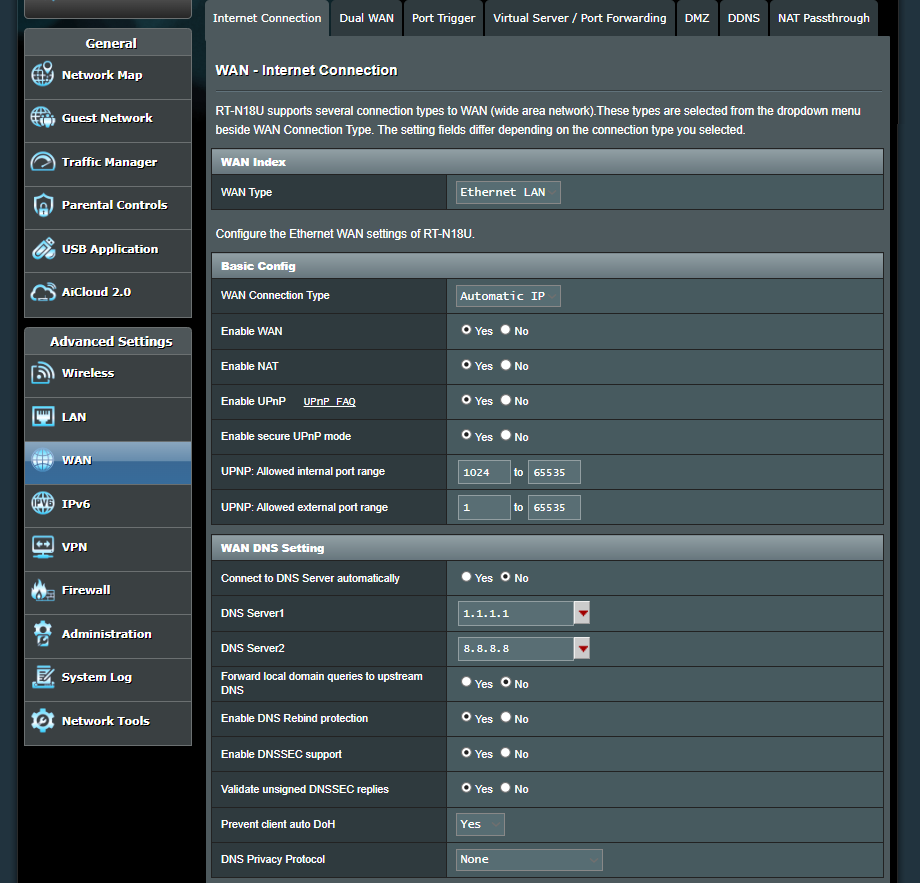
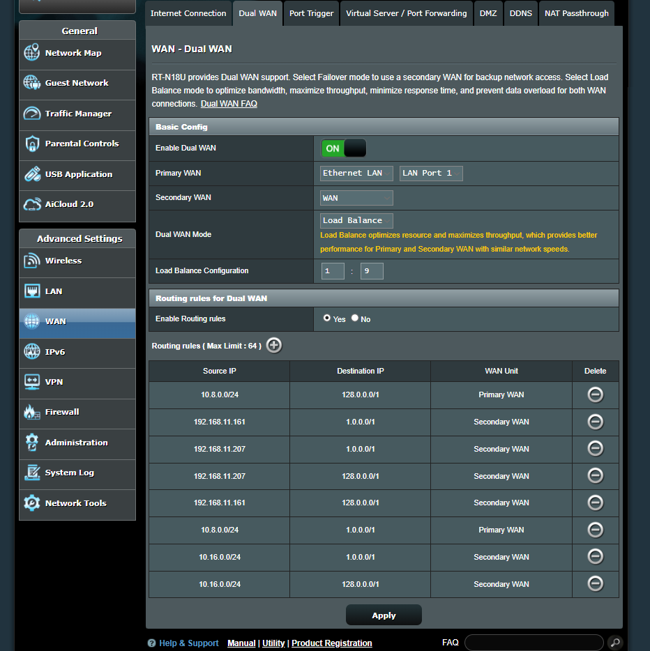
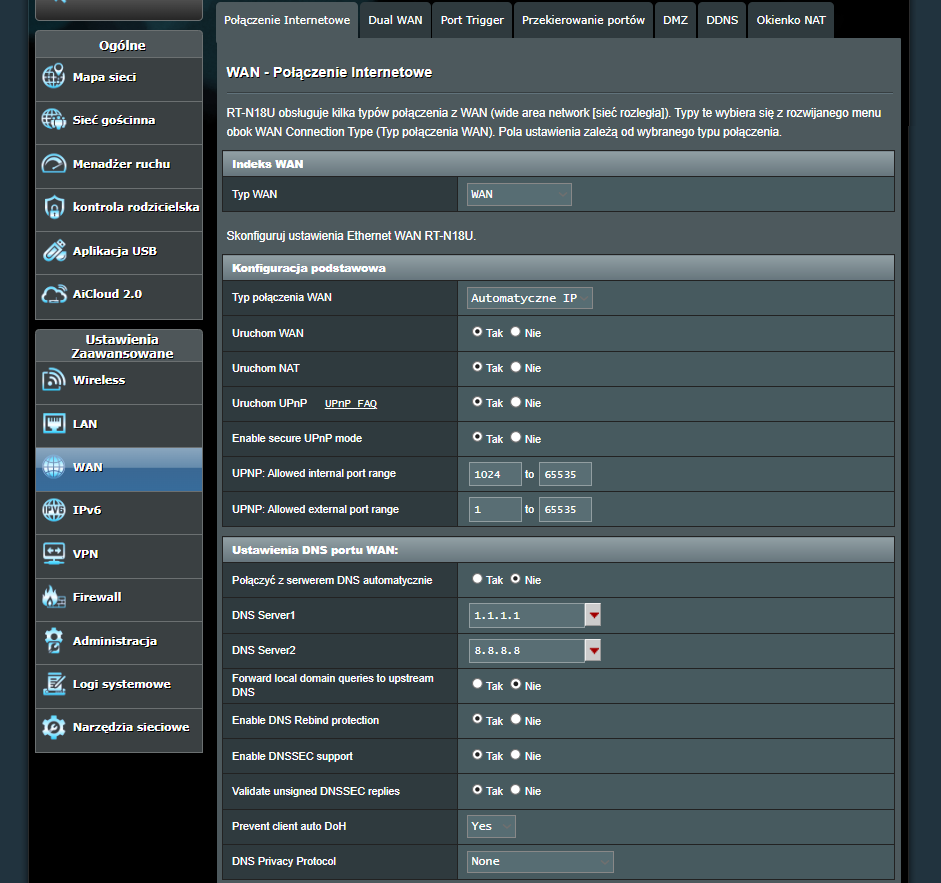
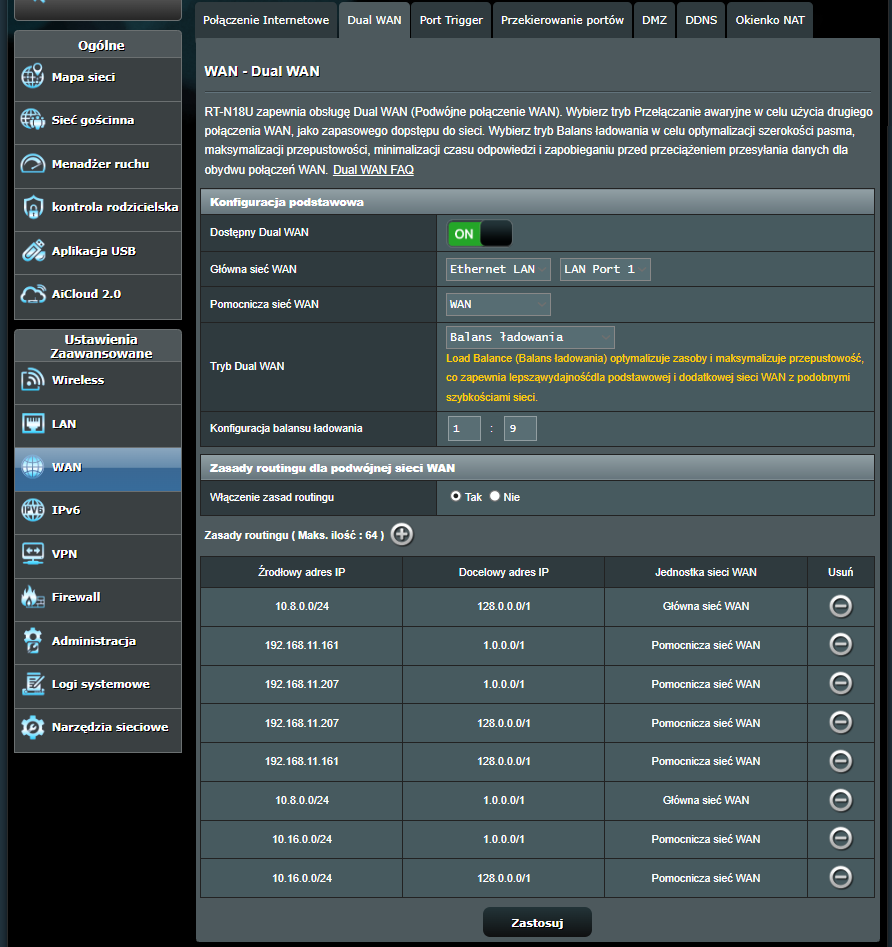

# SmartWAN Manager for ASUS RT-N18U

[English](#english) · [Polski](#polski) · [Firmware 386.3_3 download mirror](https://github.com/hattimon/asuswrt-rtn18u/releases/download/386.3_3/RT-N18U_386.3_3.trx) · [Firmware installation note](https://github.com/hattimon/asuswrt-rtn18u/tree/master) · [Upstream firmware](https://github.com/gzenux/asuswrt-rtn18u)

Local, bilingual administration panel for SmartWAN and Dual WAN on ASUS RT-N18U. The panel runs in Docker on a Raspberry Pi, Ubuntu Server, a Linux PC, or WSL 2 and manages the router over SSH.

> Firmware dependency: SmartWAN Manager was created for [ASUS RT-N18U](https://www.asus.com/Networking/RTN18U) running version `386.3_3` of the unofficial [gzenux/asuswrt-rtn18u](https://github.com/gzenux/asuswrt-rtn18u) firmware line. That project integrates [Asuswrt-Merlin](https://www.asuswrt-merlin.net/) features with the official RT-N18U GPL codebase; from version 384.9 onward its numbering does not map directly to official Asuswrt-Merlin releases. The panel does not install or upgrade router firmware. Read the [firmware installation note](https://github.com/hattimon/asuswrt-rtn18u/tree/master) and prepare the router before installing SmartWAN Manager.


## English

### What the panel does

SmartWAN Manager keeps the ASUS router as the routing backend and adds a safer, more readable management layer:

- administrative dashboard with router identity, firmware, uptime, RAM, JFFS storage, SSH state, SmartWAN daemon state, WAN health, logs, and route summaries;
- read-only network map with active LAN clients, device type, current-device route, VPN state, and WAN event history;
- guided router setup with live model/firmware detection, change preview, automatic local backup, and explicit apply confirmation;
- SmartWAN configuration and router-side presets;
- native ASUS Dual WAN configuration, load-balance/failover mode, ratios, and routing rules;
- per-device, per-subnet, destination CIDR, and domain/service routing;
- reusable service-routing groups, JSON import/export, rule validation, and optional AI-assisted rule generation;
- optional Google WAN country/location monitoring and automatic temporary service routing;
- router-side watchdog, failure confirmation, automatic failover, recovery confirmation, and return to normal routing;
- WAN-aware managed DMZ with symmetric return routing and configurable outage behavior;
- OpenVPN Server 1 and Server 2 policy, profile editor, profile download, LAN/router/Internet access, NAT, and preferred-WAN failover;
- optional Tailscale subnet-router access and optional exit-node advertisement;
- optional Cloudflare DDNS synchronization for a selected OpenVPN server and WAN;
- Ed25519 key generation (built in or with [hattimon/ssh-key-forge](https://github.com/hattimon/ssh-key-forge)), router host-key inspection, SSH password/key authentication, and Merlin script installation;
- full and SmartWAN-only backups, restore preview, safety backup, and restore confirmation;
- persistent WAN failure/recovery archive, live quality tests, routing diagnostics, and conflict warnings;
- Safe, Basic, Advanced, and Expert interface modes;
- English and Polish UI.

The default SmartWAN watchdog values are:

| Setting | Default |
|---|---:|
| Probe interval | 1 second |
| Failed probes before failover | 2 |
| Successful probes before return | 3 |

These defaults favor quick switching. Increase the interval or counters on unstable links to avoid unnecessary failovers.

### What continues to run without the panel

Most applied settings live on the router. SmartWAN rules and presets, the router-side watchdog and failover, managed VPN/DMZ policy, and Merlin hooks continue after the Docker container is stopped.

The container must remain running for container-side services: scheduled WAN country/location checks, Cloudflare DDNS, Tailscale access, copying the router's bounded RAM event journal into persistent storage, the public status/network map, and Aurelka notifications. The router still routes traffic when those panel-side services are unavailable.

### Login screen

There is no factory panel password. After the first start, set one from the installation host:

```sh
docker compose exec smartwan-manager node server/setPanelPassword.js admin 'replace-with-a-strong-password'
```

The login page provides:

- username and password authentication;
- a signed, `HttpOnly`, `SameSite=Lax` session lasting up to 12 hours;
- a password-reset command that must be run locally or through SSH on the panel host;
- Polish/English selection;
- sound and animation controls for Aurelka;
- an expandable read-only connection summary;
- a read-only network-map preview and VPN download area for clients from configured trusted LAN/VPN subnets.

Keep the panel on a trusted network. If a reverse proxy is used, configure `SMARTWAN_TRUSTED_PROXIES` narrowly and make the proxy replace untrusted forwarding headers.

### Aurelka — guardian of both WAN links

Aurelka's left and right eyes represent `wan0` and `wan1` independently:

| Eyes | Meaning | Behaviour and notifications |
|---|---|---|
| Green | The represented WAN is healthy | Aurelka is calm; the status bubble reports that all links are working. |
| Orange | The panel is reading status, data is stale/missing, or a failed WAN is in recovery confirmation | Eyes pulse while Aurelka checks the links; the bulb uses warning orange. |
| One red, one green | One WAN is down and the other remains available | Aurelka becomes alert, identifies the failed WAN, meows twice, then repeats every 30 seconds while the outage continues. |
| Both red | Both WAN links are down | Red alarm state, angry animation, danger bulb, and repeated audible alert when sound is enabled. |

The bulb pulses when WAN state changes or a new local Aurelka message arrives. Browsers may delay sound until the first user interaction. Aurelka can be clicked to show status and the five newest local messages, dragged around the login page, double-clicked to resume her route, muted, or paused. Messages are stored in the private Docker data volume, are rate-limited, and are available only through the trusted-network public endpoints.

### Suggested requirements

| Component | Practical minimum | Recommended |
|---|---|---|
| Raspberry Pi | Pi 3B+, 64-bit OS, 1 GB RAM plus swap | Pi 4/5, 2 GB+ RAM, Raspberry Pi OS Lite 64-bit or Ubuntu Server 64-bit |
| PC / mini PC / VM | 1 x86-64/ARM64 CPU, 1 GB RAM | 2 CPU threads, 2 GB RAM |
| Storage | 1 GB free | 2 GB+ free for image layers, builds, backups, and event history |
| Network | Stable LAN and SSH reachability to the router | Wired Ethernet and a fixed/reserved address for the panel host |
| Software | Linux, Docker Engine, Compose v2, Git | Current 64-bit Linux and current Docker/Compose releases |

Router requirements:

- ASUS RT-N18U with firmware `386.3_3` from [gzenux/asuswrt-rtn18u](https://github.com/gzenux/asuswrt-rtn18u);
- SSH enabled;
- JFFS custom scripts/configs enabled;
- preferably SSH key authentication;
- panel host able to reach the router's SSH port;
- Docker host port `8888/TCP` available, or another port selected in `.env`.

Optional features need outbound access to their providers. Tailscale additionally needs `/dev/net/tun`, `NET_ADMIN`, `NET_RAW`, and IP forwarding.

### Prepare the router firmware first

SmartWAN Manager is an extension of the unofficial Asuswrt-Merlin RT-N18U firmware; it is not a firmware installer. The firmware project brings [Asuswrt-Merlin](https://www.asuswrt-merlin.net/) features to the [ASUS RT-N18U](https://www.asus.com/Networking/RTN18U), based on the official RT-N18U GPL codebase. Starting with 384.9, the project's version numbers do not map directly to official Asuswrt-Merlin releases. The supported firmware must already be running before the panel connects to the router and deploys SmartWAN configuration.

#### Stable firmware download: 386.3_3

- **Preserved project mirror:** [download `RT-N18U_386.3_3.trx` from the hattimon fork](https://github.com/hattimon/asuswrt-rtn18u/releases/download/386.3_3/RT-N18U_386.3_3.trx)
- **Original upstream file:** [download from the gzenux project page](https://gzenux.github.io/asuswrt-rtn18u/RT-N18U/RT-N18U_386.3_3.trx)
- **SHA-256:** `F6C6DC222B0EC089AC913B3BF75108947B06A91462CA336424EB28BA028A318A`

The release asset in the hattimon fork is an unmodified archival copy of the upstream file. It is retained so the supported firmware remains available if the original binary is moved or removed. Original authorship and applicable licensing terms remain with the upstream project and component owners.

Follow this order:

1. Read the complete [RT-N18U firmware installation note](https://github.com/hattimon/asuswrt-rtn18u/tree/master) and back up the current router configuration.
2. If the router still runs official AsusWRT, first upgrade the official firmware to `3.0.0.4.382.52288`. This is the preparation baseline stated by the firmware project.
3. Upload the unofficial Asuswrt-Merlin RT-N18U firmware `386.3_3` through the ASUS web interface. Firmware installation is performed separately from SmartWAN Manager and at the router owner's risk.
4. After switching from official AsusWRT to this firmware, restore factory defaults with the router's hardware reset button. Configure the router again from a clean state; do not restore a settings backup created under a different firmware version.
5. Enable SSH and **JFFS custom scripts and configs** in the router interface. Only then install SmartWAN Manager, test its SSH connection and use the setup wizard or **Scripts** section.

At the final stage SmartWAN Manager uses SSH to place its managed scripts, configuration, presets and Merlin hook blocks on JFFS, then applies the selected routing settings. It never replaces the firmware image, bootloader or firmware-upgrade procedure. Keep a current backup before every firmware or routing change.

### Compatibility with other ASUS routers running Asuswrt-Merlin

The **validated and supported target remains ASUS RT-N18U with firmware 386.3_3**. Other ASUS models running [official Asuswrt-Merlin](https://www.asuswrt-merlin.net/) can be technically suitable candidates, but they are not yet certified by this project. A router must expose ASUS Dual WAN and pass the checks below before any managed routing is enabled.

SmartWAN Manager has a portable foundation: it uploads POSIX shell scripts over SSH, keeps them under `/jffs/addons/smartwan.d`, uses documented Merlin hooks in `/jffs/scripts`, and can discover the live `wan0`/`wan1` interfaces and gateways from NVRAM. The setup wizard also compares a saved profile with the live model and firmware rather than using a global RT-N18U-only allowlist.

However, the panel is **not only a script uploader**. Applying Dual WAN or managed SmartWAN settings can also:

- write `wans_dualwan`, `wans_mode`, `wans_lb_ratio`, `wans_routing_enable`, `wans_routing_rulelist` and model-dependent LAN-port values to NVRAM;
- restart WAN services;
- create IPv4 policy routes in the `wan0`/`wan1` or `100`/`101` tables;
- install `ip rule`, `ip route`, `iptables` and optional `ipset` rules;
- manage model-sensitive DMZ and OpenVPN routing behavior.

| Panel area | Expected portability to another Merlin router | Requirement / risk |
|---|---|---|
| SSH connection, identity, dashboard and read-only diagnostics | High | SSH, `nvram`, `ip`, readable `/jffs` and standard Linux status files. |
| Script upload and Merlin hooks | High | JFFS custom scripts enabled; `services-start`, `firewall-start`, `nat-start` and `wan-event` must run normally. |
| WAN discovery and observe-only monitoring | Medium to high | Two active WAN units, non-empty `wan0_ifname`/`wan1_ifname`, gateways and separate route tables. |
| SmartWAN watchdog and managed failover | Conditional | Legacy-compatible Dual WAN NVRAM, stable policy-route tables and working per-interface IPv4 probes. Test on the specific model. |
| ASUS Dual WAN **Apply**, LAN-port selection and routing rules | Model-specific | Port identifiers and NVRAM formats vary between platforms. Do not apply before validating and backing up. |
| Managed DMZ, domain routing and OpenVPN policy | Model-specific | Requires compatible `iptables` chains, `ipset` where used, bridge/interface names and VPN NVRAM/layout. |

The [official supported-model list](https://www.asuswrt-merlin.net/about) is therefore a **candidate pool, not a SmartWAN compatibility list**. Examples include the RT-AX58U/RT-AX3000, RT-AX68U, RT-AX86U/RT-AX86S, RT-AX88U and GT-AX11000 families, plus newer GT-AX, RT-AX Pro, ZenWiFi Pro and RT/GT-BE models. The router must also expose Dual WAN in its own web interface. Newer `3006.102`-based models must be treated as a separate compatibility class because WAN-port mapping, firewall behavior and NVRAM layout can differ from the validated `386` platform.

Safe evaluation procedure for an unvalidated model:

1. Confirm that the exact model appears on the official Merlin supported-model list and that its web UI provides Dual WAN.
2. Back up the router configuration and the JFFS partition. Use the main router, not an AiMesh node.
3. Enable SSH and JFFS custom scripts/configs, then connect the panel and use only the dashboard/read-only diagnostics first.
4. Verify both `wan0` and `wan1`, their interfaces, gateways and route tables. Confirm that `nvram`, `ip` and `iptables` are available; `ipset`, `curl` and `conntrack` are required only by relevant optional features.
5. Install the scripts with SmartWAN disabled or in **Observe only** mode. Do not use the setup wizard or **ASUS Dual WAN Apply** during the first compatibility check.
6. Test each WAN separately, confirm that routing and recovery survive a firewall/WAN restart, then enable managed features one at a time.

Until this procedure has been completed and documented for a model/firmware pair, describe it as **experimental**, not supported. Do not restore an RT-N18U backup or preset onto a different model.

### Install on Raspberry Pi

1. Install a 64-bit Raspberry Pi OS Lite or Ubuntu Server image.
2. Install Git, Docker Engine, and Docker Compose v2 using the official [Docker Debian instructions](https://docs.docker.com/engine/install/debian/) or [Docker Ubuntu instructions](https://docs.docker.com/engine/install/ubuntu/).
3. Allow your user to run Docker, or prefix Docker commands with `sudo`.
4. Clone and start the panel:

```sh
git clone https://github.com/hattimon/SmartWAN-Manager.git
cd SmartWAN-Manager
cp .env.example .env
docker compose up -d --build
docker compose exec smartwan-manager node server/setPanelPassword.js admin 'replace-with-a-strong-password'
```

Open `http://<raspberry-pi-address>:8888`.

To choose the first free port beginning at `8888`:

```sh
sh scripts/start-smartwan-manager.sh
```

### Install on Ubuntu Server or a Linux PC

```sh
sudo apt update
sudo apt install -y git
git clone https://github.com/hattimon/SmartWAN-Manager.git
cd SmartWAN-Manager
cp .env.example .env
docker compose up -d --build
docker compose exec smartwan-manager node server/setPanelPassword.js admin 'replace-with-a-strong-password'
```

Install Docker first from the official [Ubuntu guide](https://docs.docker.com/engine/install/ubuntu/). Open `http://<server-address>:8888` and allow that port only on the trusted LAN if a host firewall is enabled.

### Install in WSL 2

1. Install WSL 2 with Ubuntu and enable Docker Desktop WSL integration.
2. Clone into the Linux filesystem (for example under `~/`, not `/mnt/c/`) and run:

```sh
git clone https://github.com/hattimon/SmartWAN-Manager.git
cd SmartWAN-Manager
cp .env.example .env
docker compose up -d --build
docker compose exec smartwan-manager node server/setPanelPassword.js admin 'replace-with-a-strong-password'
```

Open `http://localhost:8888` from Windows. The container must be able to reach the router's LAN address and SSH port. If Docker Desktop/WSL routing prevents that, use native Ubuntu, a small Linux VM in bridged mode, or a Raspberry Pi on the same LAN.

### Optional Tailscale container networking

The base Compose file starts without elevated network capabilities and is the most portable choice. On a Linux host with `/dev/net/tun`, start with the Tailscale overlay:

```sh
docker compose -f docker-compose.yml -f docker-compose.tailscale.yml up -d --build
```

Then configure and authorize Tailscale in the VPN tab. Do not use the overlay on a host that does not expose `/dev/net/tun` to Docker.

### First router setup

1. Enable SSH and JFFS custom scripts/configs in the ASUS interface.
2. Open **Configuration**, enter the router address, SSH port, username, and authentication method, then test SSH.
3. Prefer **SSH key** → generate an Ed25519 key in the panel or with [SSH Key Forge](https://github.com/hattimon/ssh-key-forge) → verify the router host fingerprint → paste the public key into ASUS **Administration → System → Authorized keys**.
4. Open **Scripts** and select **Install / update router scripts**.
5. Use the guided setup wizard or configure SmartWAN manually.
6. Preview conflicts and changes, apply, and verify both WAN cards, watchdog status, and important routes.

The installer uploads:

- `/jffs/addons/smartwan.d/backend.sh`;
- `/jffs/addons/smartwan.d/smartwanctl.sh`;
- `/jffs/addons/smartwan.d/smartwan.conf` when no configuration exists;
- managed blocks in `services-start`, `firewall-start`, `nat-start`, and `wan-event` Merlin hooks.

Existing hook content outside `# SMARTWAN MANAGED BEGIN` / `# SMARTWAN MANAGED END` is preserved.

### Proposed WAN settings

The following screenshot shows a practical baseline for a DHCP-based WAN using public DNS resolvers. Open **WAN → Internet Connection**, select the required WAN index and configure each Internet link separately.

[](docs/recommended-wan-settings-en.png)

Recommended baseline:

- keep **WAN** and **NAT** enabled;
- use **Automatic IP** only when the ISP provides the address through DHCP—retain the ISP-required PPPoE, static-IP or VLAN configuration where applicable;
- set **Connect to DNS Server automatically** to **No**, with `1.1.1.1` as DNS Server 1 and `8.8.8.8` as DNS Server 2;
- keep **Forward local domain queries to upstream DNS** set to **No** when public resolvers are used;
- enable **DNS Rebind protection** and **DNSSEC support**, while leaving **Validate unsigned DNSSEC replies** disabled;
- **Prevent client auto DoH: Yes** and **DNS Privacy Protocol: None** match the illustrated baseline. Change these only when intentionally deploying another encrypted-DNS policy;
- UPnP is shown enabled for applications that require automatic port mappings. It is optional—disable UPnP when it is not needed, or at minimum retain secure UPnP mode and restrict its allowed ranges.

The WAN type (`WAN`, `Ethernet LAN`, USB or another supported port) must match the physical Dual WAN layout. These DNS settings do not replace SmartWAN policy routing and do not guarantee session compatibility when related services are deliberately split between different public WAN addresses.

### Proposed Dual WAN settings

The screenshot below presents an example of ASUS Dual WAN working in **Load Balance** mode together with source-based routing rules managed by SmartWAN.

[](docs/recommended-dual-wan-settings-en.png)

Recommended approach:

- enable **Dual WAN** and map **Primary WAN** and **Secondary WAN** to the ports actually used by the two modems or upstream routers;
- select **Load Balance** when both links should carry traffic simultaneously. Select native **Failover** instead when the secondary link should remain a standby connection;
- treat the illustrated `1:9` ratio as an installation-specific example, not a universal default. Set the ratio according to measured link capacity, stability and the traffic distribution you want;
- enable ASUS routing rules only when devices or subnets need an explicit preferred WAN;
- a complete all-IPv4 source assignment uses two complementary destination entries: `1.0.0.0/1` and `128.0.0.0/1`. Both entries must use the same source and WAN—never copy only half of the pair;
- the private source addresses shown in the table are examples from a local installation. Replace them with the addresses/subnets in your own LAN or VPN configuration, preferably through the SmartWAN visual rule editor;
- let SmartWAN install and maintain managed rules. Avoid editing the ASUS list at the same time as the panel is applying a preset, failover override or temporary location-routing layer.

Static preferred-WAN rules do not replace connection health monitoring. SmartWAN can temporarily override them during an outage only when the relevant failover behaviour is enabled.

### Storage model

On the router:

- SmartWAN configuration and presets;
- helper scripts and Merlin hook blocks;
- active route/firewall state;
- bounded runtime logs and WAN transition journal under `/tmp` (RAM).

In the Docker volume `smartwan-data`:

- panel login and session material;
- router connection settings and optional credentials;
- generated SSH private key;
- backups, UI preferences, service-routing groups, optional provider keys/tokens, prepared VPN profiles, Aurelka notes, and persistent WAN history.

Back up the volume and protect it as a credential store.

### Operations

For optional graphical management of this container and other Docker hosts—locally or remotely—see [hattimon/DCC](https://github.com/hattimon/DCC).

```sh
# status
docker compose ps

# logs
docker compose logs -f smartwan-manager

# update
git pull --ff-only
docker compose up -d --build

# stop without deleting data
docker compose down

# start again
docker compose up -d
```

Do not use `docker compose down -v` unless the panel data volume is intentionally being deleted.

### Development and verification

```sh
npm ci
npm test
npm run lint
npm run build
docker compose config
```

Run the development UI and API separately:

```sh
npm run dev
npm run server
```

The Vite server proxies `/api` to `http://127.0.0.1:8080`.

---

## Polski

### Do czego służy panel

SmartWAN Manager pozostawia router ASUS jako właściwy silnik routingu i dodaje wygodną, czytelną warstwę administracyjną:

- panel administracyjny ze stanem routera, firmware, uptime, RAM, JFFS, SSH, demona SmartWAN, obu WAN-ów, logów i tras;
- mapa sieci z aktywnymi klientami LAN, trasą bieżącego urządzenia, stanem VPN i historią zdarzeń WAN;
- kreator konfiguracji z wykrywaniem modelu/firmware, podglądem zmian, automatycznym backupem i potwierdzeniem zastosowania;
- konfiguracja SmartWAN i presety zapisane na routerze;
- konfiguracja natywnego ASUS Dual WAN, trybu load balance/failover, proporcji i reguł routingu;
- routing według urządzenia, podsieci, docelowego CIDR oraz domeny/usługi;
- grupy reguł usług, import/eksport JSON, walidacja i opcjonalne generowanie reguł z pomocą AI;
- opcjonalny monitoring kraju/lokalizacji WAN dla usług Google z automatyczną regułą tymczasową;
- routerowy watchdog, potwierdzanie awarii, failover, potwierdzanie odzyskania i powrót do normalnego routingu;
- zarządzane DMZ zależne od WAN-u z symetryczną trasą powrotną;
- polityka OpenVPN Server 1 i 2, edytor i pobieranie profili, dostęp LAN/router/Internet, NAT i preferowany WAN z failover;
- opcjonalny Tailscale subnet router/exit node oraz Cloudflare DDNS;
- generowanie klucza Ed25519 (w panelu lub przez [hattimon/ssh-key-forge](https://github.com/hattimon/ssh-key-forge)), kontrola klucza hosta, logowanie SSH hasłem/kluczem i instalacja skryptów Merlin;
- backup pełny lub tylko SmartWAN, podgląd i bezpieczne przywracanie;
- trwała historia awarii/odzyskania, testy jakości WAN, diagnostyka tras i ostrzeżenia o konfliktach;
- tryby interfejsu Bezpieczny, Podstawowy, Zaawansowany i Ekspert;
- interfejs polski i angielski.

Domyślne ustawienia watchdog SmartWAN:

| Ustawienie | Domyślnie |
|---|---:|
| Interwał testu | 1 sekunda |
| Błędy do przełączenia | 2 |
| Udane testy do powrotu | 3 |

To szybki profil przełączania. Dla niestabilnych łączy warto zwiększyć interwał lub liczniki, aby ograniczyć zbędne przełączenia.

### Co działa po wyłączeniu panelu

Większość zastosowanych ustawień znajduje się na routerze. Reguły i presety SmartWAN, routerowy watchdog i failover, zarządzana polityka VPN/DMZ oraz hooki Merlin działają dalej po zatrzymaniu kontenera.

Kontener musi pozostać uruchomiony dla funkcji wykonywanych przez panel: cyklicznego sprawdzania kraju/lokalizacji WAN, Cloudflare DDNS, dostępu Tailscale, kopiowania zdarzeń z bufora RAM routera do trwałej historii, publicznego statusu/mapy sieci oraz powiadomień Aurelki. Brak tych usług nie zatrzymuje routingu wykonywanego przez router.

### Panel logowania

Panel nie ma fabrycznego hasła. Po pierwszym uruchomieniu ustaw je na urządzeniu z Dockerem:

```sh
docker compose exec smartwan-manager node server/setPanelPassword.js admin 'wstaw-tu-mocne-haslo'
```

Ekran logowania zawiera:

- logowanie nazwą użytkownika i hasłem;
- podpisaną sesję `HttpOnly`, `SameSite=Lax` ważną maksymalnie 12 godzin;
- instrukcję resetu hasła wykonywanego lokalnie albo przez SSH na hoście panelu;
- wybór języka polskiego/angielskiego;
- sterowanie dźwiękiem i animacją Aurelki;
- rozwijany, tylko do odczytu stan połączenia;
- podgląd mapy sieci i obszar pobierania VPN dla klientów z dozwolonych podsieci LAN/VPN.

Panel powinien być dostępny tylko w zaufanej sieci. Przy reverse proxy ustaw `SMARTWAN_TRUSTED_PROXIES` możliwie wąsko i dopilnuj, aby proxy zastępowało niezaufane nagłówki przekazywania adresu klienta.

### Aurelka — strażniczka obu WAN-ów

Lewe i prawe oko Aurelki odpowiadają niezależnie za `wan0` i `wan1`:

| Oczy | Znaczenie | Zachowanie i powiadomienia |
|---|---|---|
| Zielone | Dany WAN jest sprawny | Aurelka jest spokojna, a dymek informuje, że łącza działają. |
| Pomarańczowe | Panel odczytuje stan, dane są nieaktualne/brakujące albo odzyskane łącze czeka na potwierdzenie powrotu | Oczy pulsują podczas sprawdzania; żarówka przyjmuje pomarańczowy stan ostrzegawczy. |
| Jedno czerwone, drugie zielone | Jeden WAN nie działa, a drugi jest dostępny | Aurelka wskazuje nazwę uszkodzonego WAN-u, miauczy dwa razy, a następnie co 30 sekund przypomina o trwającej awarii. |
| Oba czerwone | Oba WAN-y nie działają | Czerwony alarm, zła animacja, czerwona żarówka i powtarzane powiadomienie dźwiękowe, jeśli dźwięk jest włączony. |

Żarówka pulsuje po zmianie stanu WAN albo pojawieniu się nowej lokalnej wiadomości. Przeglądarka może odblokować dźwięk dopiero po pierwszej interakcji użytkownika. Aurelka pokazuje stan i pięć najnowszych wiadomości, daje się przeciągać, wraca na trasę po podwójnym kliknięciu, może zostać wyciszona lub zatrzymana. Wiadomości są zapisywane w woluminie Dockera, mają ograniczenie częstotliwości i są udostępniane tylko przez endpointy dla zaufanej sieci.

### Sugerowane wymagania

| Element | Praktyczne minimum | Zalecane |
|---|---|---|
| Raspberry Pi | Pi 3B+, system 64-bit, 1 GB RAM i swap | Pi 4/5, co najmniej 2 GB RAM, Raspberry Pi OS Lite 64-bit lub Ubuntu Server 64-bit |
| PC / mini PC / VM | 1 rdzeń x86-64/ARM64, 1 GB RAM | 2 wątki CPU, 2 GB RAM |
| Dysk | 1 GB wolnego | co najmniej 2 GB na obrazy, build, backupy i historię |
| Sieć | stabilny LAN i dostęp SSH do routera | Ethernet i stały/zarezerwowany adres hosta panelu |
| Oprogramowanie | Linux, Docker Engine, Compose v2, Git | aktualny 64-bitowy Linux i bieżący Docker/Compose |

Router wymaga firmware `386.3_3` z [gzenux/asuswrt-rtn18u](https://github.com/gzenux/asuswrt-rtn18u), włączonego SSH i skryptów/configów JFFS. Host panelu musi osiągać port SSH routera. Domyślnie panel używa lokalnego portu `8888/TCP`.

### Najpierw przygotuj firmware routera

SmartWAN Manager jest rozszerzeniem nieoficjalnego firmware Asuswrt-Merlin dla RT-N18U, a nie instalatorem firmware. Projekt firmware przenosi funkcje [Asuswrt-Merlin](https://www.asuswrt-merlin.net/) na router [ASUS RT-N18U](https://www.asus.com/Networking/RTN18U), bazując na oficjalnym kodzie GPL tego modelu. Od wersji 384.9 numeracja projektu nie odpowiada bezpośrednio wydaniom oficjalnego Asuswrt-Merlin. Obsługiwana wersja musi już działać na routerze, zanim panel połączy się przez SSH i wdroży konfigurację SmartWAN.

#### Stabilny firmware do pobrania: 386.3_3

- **Kopia zachowana w projekcie:** [pobierz `RT-N18U_386.3_3.trx` z forka hattimon](https://github.com/hattimon/asuswrt-rtn18u/releases/download/386.3_3/RT-N18U_386.3_3.trx)
- **Oryginalny plik źródłowy:** [pobierz ze strony projektu gzenux](https://gzenux.github.io/asuswrt-rtn18u/RT-N18U/RT-N18U_386.3_3.trx)
- **SHA-256:** `F6C6DC222B0EC089AC913B3BF75108947B06A91462CA336424EB28BA028A318A`

Plik wydania w forku hattimon jest niezmodyfikowaną kopią archiwalną pliku źródłowego. Kopia jest przechowywana, aby obsługiwana wersja firmware pozostała dostępna także po przeniesieniu lub usunięciu oryginału. Autorstwo oraz właściwe warunki licencyjne pozostają po stronie projektu źródłowego i właścicieli komponentów.

Zachowaj następującą kolejność:

1. Przeczytaj pełną [instrukcję instalacji firmware RT-N18U](https://github.com/hattimon/asuswrt-rtn18u/tree/master) i wykonaj kopię bieżącej konfiguracji routera.
2. Jeżeli router nadal działa na oficjalnym AsusWRT, najpierw zaktualizuj oficjalny firmware do wersji `3.0.0.4.382.52288`. Jest to wersja przygotowawcza wskazana przez projekt firmware.
3. Przez interfejs WWW routera wgraj nieoficjalny Asuswrt-Merlin RT-N18U `386.3_3`. Instalacja firmware jest wykonywana niezależnie od SmartWAN Managera i na odpowiedzialność właściciela routera.
4. Po przejściu z oficjalnego AsusWRT przywróć ustawienia fabryczne sprzętowym przyciskiem reset. Skonfiguruj router od nowa; nie przywracaj pliku ustawień utworzonego w innej wersji firmware.
5. Włącz SSH oraz **niestandardowe skrypty i konfiguracje JFFS**. Dopiero wtedy zainstaluj SmartWAN Manager, sprawdź połączenie SSH i użyj kreatora albo sekcji **Skrypty**.

Na ostatnim etapie SmartWAN Manager przez SSH zapisuje na JFFS zarządzane skrypty, konfigurację, presety i bloki hooków Merlin, a następnie stosuje wybrane ustawienia routingu. Panel nie zastępuje obrazu firmware, bootloadera ani procedury aktualizacji firmware. Przed każdą zmianą firmware lub routingu zachowaj aktualną kopię bezpieczeństwa.

### Zgodność z innymi routerami ASUS z Asuswrt-Merlin

**Zweryfikowanym i wspieranym celem pozostaje ASUS RT-N18U z firmware 386.3_3.** Inne modele ASUS działające na [oficjalnym Asuswrt-Merlin](https://www.asuswrt-merlin.net/) mogą być technicznie odpowiednimi kandydatami, ale nie są jeszcze certyfikowane przez ten projekt. Router musi udostępniać ASUS Dual WAN i przejść poniższe kontrole przed włączeniem zarządzanego routingu.

Podstawa SmartWAN Managera jest przenośna: panel przesyła przez SSH skrypty POSIX shell, przechowuje je w `/jffs/addons/smartwan.d`, używa udokumentowanych hooków Merlin w `/jffs/scripts` oraz może wykrywać aktualne interfejsy i bramy `wan0`/`wan1` z NVRAM. Kreator porównuje też zapisany profil z bieżącym modelem i firmware, zamiast korzystać z globalnej blokady wyłącznie dla RT-N18U.

Panel **nie jest jednak wyłącznie narzędziem do przesyłania skryptów**. Zastosowanie ustawień Dual WAN lub zarządzanego SmartWAN może również:

- zapisywać do NVRAM `wans_dualwan`, `wans_mode`, `wans_lb_ratio`, `wans_routing_enable`, `wans_routing_rulelist` oraz zależne od modelu ustawienia portu LAN;
- restartować usługi WAN;
- tworzyć reguły routingu IPv4 w tabelach `wan0`/`wan1` albo `100`/`101`;
- instalować reguły `ip rule`, `ip route`, `iptables` i opcjonalnie `ipset`;
- zarządzać zależnym od modelu routingiem DMZ i OpenVPN.

| Obszar panelu | Przewidywana przenośność na inny router Merlin | Wymaganie / ryzyko |
|---|---|---|
| Połączenie SSH, identyfikacja, dashboard i diagnostyka tylko do odczytu | Wysoka | SSH, `nvram`, `ip`, dostępny `/jffs` i standardowe pliki stanu Linuksa. |
| Przesyłanie skryptów i hooki Merlin | Wysoka | Włączone skrypty JFFS; poprawne działanie `services-start`, `firewall-start`, `nat-start` i `wan-event`. |
| Wykrywanie WAN i monitoring w trybie obserwacji | Średnia do wysokiej | Dwa aktywne WAN-y, niepuste `wan0_ifname`/`wan1_ifname`, bramy i oddzielne tabele routingu. |
| Watchdog SmartWAN i zarządzany failover | Warunkowa | Zgodne zmienne NVRAM Dual WAN, stabilne tabele routingu i działające sondy IPv4 wymuszone na interfejsach. Wymaga testu danego modelu. |
| **Zastosowanie** ASUS Dual WAN, wybór portu LAN i reguły | Zależna od modelu | Identyfikatory portów i formaty NVRAM różnią się między platformami. Nie stosuj przed walidacją i backupem. |
| Zarządzane DMZ, routing domen i polityka OpenVPN | Zależna od modelu | Wymaga zgodnych łańcuchów `iptables`, `ipset` dla używanych funkcji, nazw mostów/interfejsów oraz układu VPN/NVRAM. |

[Oficjalna lista modeli Asuswrt-Merlin](https://www.asuswrt-merlin.net/about) jest zatem **pulą kandydatów, a nie listą zgodności SmartWAN**. Przykładowe rodziny to RT-AX58U/RT-AX3000, RT-AX68U, RT-AX86U/RT-AX86S, RT-AX88U i GT-AX11000, a także nowsze GT-AX, RT-AX Pro, ZenWiFi Pro oraz RT/GT-BE. Dany router musi dodatkowo udostępniać Dual WAN we własnym interfejsie WWW. Nowsze modele oparte na linii `3006.102` należy traktować jako osobną klasę zgodności, ponieważ mapowanie portów WAN, zachowanie firewalla i układ NVRAM mogą różnić się od zweryfikowanej platformy `386`.

Bezpieczna procedura testu niewalidowanego modelu:

1. Sprawdź, czy dokładny model znajduje się na oficjalnej liście Asuswrt-Merlin i czy jego interfejs WWW udostępnia Dual WAN.
2. Wykonaj backup konfiguracji routera oraz partycji JFFS. Używaj routera głównego, nie węzła AiMesh.
3. Włącz SSH i niestandardowe skrypty/configi JFFS, połącz panel i początkowo korzystaj wyłącznie z dashboardu oraz diagnostyki tylko do odczytu.
4. Zweryfikuj oba WAN-y, ich interfejsy, bramy i tabele routingu. Potwierdź obecność `nvram`, `ip` i `iptables`; `ipset`, `curl` oraz `conntrack` są wymagane tylko przez odpowiednie funkcje opcjonalne.
5. Zainstaluj skrypty przy wyłączonym SmartWAN lub w trybie **Tylko obserwacja**. Podczas pierwszego testu zgodności nie używaj kreatora ani funkcji **Zastosuj ASUS Dual WAN**.
6. Przetestuj każde łącze osobno, sprawdź routing i powrót po restarcie firewalla/WAN, a następnie włączaj funkcje zarządzane pojedynczo.

Dopóki ta procedura nie zostanie wykonana i udokumentowana dla konkretnej pary model/firmware, należy określać ją jako **eksperymentalną**, a nie wspieraną. Nie przywracaj backupu ani presetu RT-N18U na innym modelu.

### Instalacja na Raspberry Pi

Zainstaluj system 64-bit oraz Git, Docker Engine i Compose v2 według oficjalnej instrukcji dla [Debiana](https://docs.docker.com/engine/install/debian/) albo [Ubuntu](https://docs.docker.com/engine/install/ubuntu/), a następnie:

```sh
git clone https://github.com/hattimon/SmartWAN-Manager.git
cd SmartWAN-Manager
cp .env.example .env
docker compose up -d --build
docker compose exec smartwan-manager node server/setPanelPassword.js admin 'wstaw-tu-mocne-haslo'
```

Otwórz `http://<adres-raspberry-pi>:8888`. Skrypt `sh scripts/start-smartwan-manager.sh` może automatycznie wybrać pierwszy wolny port od `8888`.

### Instalacja na Ubuntu Server / PC

```sh
sudo apt update
sudo apt install -y git
git clone https://github.com/hattimon/SmartWAN-Manager.git
cd SmartWAN-Manager
cp .env.example .env
docker compose up -d --build
docker compose exec smartwan-manager node server/setPanelPassword.js admin 'wstaw-tu-mocne-haslo'
```

Docker zainstaluj wcześniej według oficjalnej [instrukcji Ubuntu](https://docs.docker.com/engine/install/ubuntu/). Otwórz `http://<adres-serwera>:8888`; zapora powinna dopuszczać ten port tylko z zaufanego LAN-u.

### Instalacja w WSL 2

Włącz WSL 2 z Ubuntu oraz integrację WSL w Docker Desktop. Sklonuj repozytorium do linuksowego katalogu, np. `~/SmartWAN-Manager`, i wykonaj te same komendy `docker compose`. Panel będzie dostępny pod `http://localhost:8888`. Kontener musi mieć trasę do adresu LAN i portu SSH routera. Jeśli sieć Docker Desktop/WSL to uniemożliwia, użyj natywnego Ubuntu, małej maszyny wirtualnej z mostkowaną siecią albo Raspberry Pi w tym samym LAN-ie.

### Opcjonalny Tailscale

Podstawowy Compose nie wymaga podwyższonych uprawnień sieciowych. Na Linuksie z `/dev/net/tun` uruchom wariant Tailscale:

```sh
docker compose -f docker-compose.yml -f docker-compose.tailscale.yml up -d --build
```

Następnie skonfiguruj i autoryzuj urządzenie w zakładce VPN. Nie używaj nakładki na hoście, który nie udostępnia `/dev/net/tun` do Dockera.

### Pierwsza konfiguracja routera

1. Włącz SSH oraz niestandardowe skrypty/configi JFFS w ASUS.
2. W **Konfiguracji** wpisz adres, port, użytkownika i metodę uwierzytelnienia, po czym przetestuj SSH.
3. Najlepiej wygeneruj klucz Ed25519 w panelu albo przez [SSH Key Forge](https://github.com/hattimon/ssh-key-forge), sprawdź fingerprint hosta i wklej klucz publiczny do **Administration → System → Authorized keys**.
4. W **Skryptach** wybierz instalację/aktualizację skryptów routera.
5. Użyj kreatora albo ręcznej konfiguracji SmartWAN.
6. Sprawdź konflikty i podgląd zmian, zastosuj ustawienia, a następnie zweryfikuj oba WAN-y, watchdog i ważne trasy.

Instalator zachowuje treść hooków poza blokami `# SMARTWAN MANAGED BEGIN` / `# SMARTWAN MANAGED END`.

### Proponowane ustawienia WAN

Poniższy zrzut przedstawia praktyczną konfigurację bazową dla łącza WAN korzystającego z DHCP i publicznych serwerów DNS. Otwórz **WAN → Połączenie internetowe**, wybierz właściwy indeks WAN i skonfiguruj każde łącze internetowe oddzielnie.

[](docs/proponowane-ustawienia-wan-pl.png)

Proponowana konfiguracja bazowa:

- pozostaw włączone **WAN** i **NAT**;
- używaj **Automatycznego IP** tylko wtedy, gdy operator przydziela adres przez DHCP—zachowaj wymagane przez operatora PPPoE, adres statyczny lub konfigurację VLAN;
- ustaw **Połącz z serwerem DNS automatycznie** na **Nie**, DNS Server 1 na `1.1.1.1`, a DNS Server 2 na `8.8.8.8`;
- przy publicznych serwerach DNS pozostaw **Forward local domain queries to upstream DNS** na **Nie**;
- włącz **DNS Rebind protection** i **DNSSEC support**, natomiast **Validate unsigned DNSSEC replies** pozostaw wyłączone;
- **Prevent client auto DoH: Yes** oraz **DNS Privacy Protocol: None** odpowiadają konfiguracji ze zrzutu. Zmieniaj je tylko przy świadomym wdrożeniu innej polityki szyfrowanego DNS;
- na zrzucie UPnP jest włączone z myślą o aplikacjach wymagających automatycznego mapowania portów. Jest opcjonalne—wyłącz UPnP, jeżeli nie jest potrzebne, albo co najmniej pozostaw tryb bezpieczny i ogranicz dozwolone zakresy.

Typ WAN (`WAN`, `Ethernet LAN`, USB albo inny obsługiwany port) musi odpowiadać fizycznemu układowi Dual WAN. Te ustawienia DNS nie zastępują routingu polityk SmartWAN i nie gwarantują zgodności sesji, jeśli powiązane usługi są celowo rozdzielane między dwa różne publiczne adresy WAN.

### Proponowane ustawienia Dual WAN

Poniższy zrzut przedstawia przykładową konfigurację ASUS Dual WAN w trybie **Balans ładowania** wraz z regułami routingu według źródła zarządzanymi przez SmartWAN.

[](docs/proponowane-ustawienia-dual-wan-pl.png)

Proponowany sposób konfiguracji:

- włącz **Dual WAN** i przypisz **Główną sieć WAN** oraz **Pomocniczą sieć WAN** do portów rzeczywiście używanych przez oba modemy lub routery operatorów;
- wybierz **Balans ładowania**, jeżeli oba łącza mają jednocześnie przenosić ruch. Wybierz natywny tryb **Przełączanie awaryjne**, jeżeli łącze pomocnicze ma pozostawać w rezerwie;
- traktuj widoczną proporcję `1:9` jako przykład właściwy dla konkretnej instalacji, a nie uniwersalną wartość domyślną. Dopasuj ją do zmierzonej przepustowości, stabilności łączy i oczekiwanego podziału ruchu;
- włącz zasady routingu ASUS tylko wtedy, gdy określone urządzenia lub podsieci wymagają preferowanego WAN-u;
- pełne przypisanie całego ruchu IPv4 danego źródła składa się z dwóch uzupełniających wpisów docelowych: `1.0.0.0/1` oraz `128.0.0.0/1`. Oba wpisy muszą mieć to samo źródło i WAN—nie kopiuj tylko jednej części pary;
- prywatne adresy źródłowe widoczne w tabeli są przykładem z lokalnej instalacji. Zastąp je adresami i podsieciami własnego LAN-u lub VPN, najlepiej przez wizualny edytor reguł SmartWAN;
- pozwól SmartWAN instalować i utrzymywać reguły zarządzane. Nie edytuj równocześnie listy ASUS, gdy panel stosuje preset, awaryjne nadpisanie tras albo tymczasową warstwę routingu lokalizacji.

Statyczne reguły preferowanego WAN-u nie zastępują monitoringu stanu łączy. SmartWAN może je tymczasowo nadpisać podczas awarii tylko wtedy, gdy odpowiednie zachowanie failover jest włączone.

### Dane i utrzymanie

Router przechowuje konfigurację, presety, skrypty, hooki i aktywny stan routingu. Logi wykonawcze i ograniczony bufor zdarzeń znajdują się w `/tmp`, czyli w RAM-ie routera.

Wolumin `smartwan-data` przechowuje logowanie panelu, ustawienia połączenia, opcjonalne dane uwierzytelniające, prywatny klucz SSH, backupy, preferencje, grupy reguł, opcjonalne klucze/tokeny usług, profile VPN, notatki Aurelki i trwałą historię WAN. Traktuj go jak magazyn poświadczeń i wykonuj jego backup.

Do opcjonalnego graficznego zarządzania tym kontenerem oraz innymi hostami Docker — lokalnie i zdalnie — możesz użyć [hattimon/DCC](https://github.com/hattimon/DCC).

```sh
# stan
docker compose ps

# logi
docker compose logs -f smartwan-manager

# aktualizacja
git pull --ff-only
docker compose up -d --build

# zatrzymanie bez kasowania danych
docker compose down
```

Nie używaj `docker compose down -v`, chyba że świadomie chcesz usunąć wolumin z danymi panelu.
